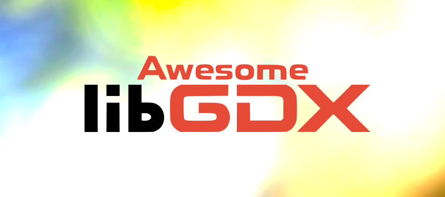

# Awesome LibGDX  

> LibGDX is a relatively low level, free, open source cross platform game development framework written in Java. Official Link: [LibGDX Homepage](https://libgdx.badlogicgames.com/)

This list is a curated collection of awesome resources, tools, tutorials, and projects to help developers make _awesome_ games, conforming to the [Awesome Manifesto](https://github.com/sindresorhus/awesome/blob/master/awesome.md).

Contributions *very welcome* but first see [Contributing](#contributing).

---

## Contents

- [Resources](#resources)
    - [Artificial Intelligence](#artificial-intelligence)
    - [Controllers](#controllers)
    - [Entity Component System (ECS)](#entity-component-system-ecs)
    - [Physics](#physics)
    - [Services](#services)
    - [Setup and Deployment](#setup-and-deployment)
    - [User Interface](#user-interface)
    - [Visual Effects](#visual-effects)
    - [Others](#others)
- [Tutorials](#tutorials)
- [Community](#community)
- [Other Lists](#other-lists)

## Resources

_Resources that can be used in libGDX code to boost the framework's capabilities._

#### Artificial Intelligence
- [gdx-ai](https://github.com/libgdx/gdx-ai) - Artificial Intelligence framework featuring Steering Behaviors, Formation Motion, Pathfinding, Behavior Trees and Finite State Machines.

#### Controllers
- [Controllers](https://github.com/libgdx/libgdx/tree/master/extensions/gdx-controllers) - Adds full support to gamepads and joysticks.
- [gdx-controllerutils](https://github.com/MrStahlfelge/gdx-controllerutils) - Adds Scene2D button input support, user configurable button mappings and hotplugging for LWJGL2.

#### Entity Component System (ECS)
- [Artemis-odb](https://github.com/junkdog/artemis-odb) - High performance java based Entity-Component-System framework.
- [Ashley](https://github.com/libgdx/ashley) - A Java entity system inspired by Ash & Artemis.

#### Physics
- [Box2D](https://github.com/libgdx/libgdx/tree/master/extensions/gdx-box2d) - One of the most popular physics libraries for 2D games.
- [Bullet](https://github.com/libgdx/libgdx/tree/master/extensions/gdx-bullet) - 3D Collision Detection and Rigid Body Dynamics Library.

#### Services
- [gdx-facebook](https://github.com/TomGrill/gdx-facebook) - Provides cross-platform support for Facebook Graph API.
- [gdx-fireapp](https://github.com/mk-5/gdx-fireapp) - Cross-platform API for Firebase.
- [gdx-firebase](https://github.com/TomGrill/gdx-firebase) - Cross-platform (only Desktop/Android) API for Firebase.
- [gdx-gameanalytics](https://github.com/MrStahlfelge/gdx-gameanalytics) - gameanalytics.com REST API client implementation for libGDX. Works on all backends.
- [gdx-gamesvcs](https://github.com/MrStahlfelge/gdx-gamesvcs) - Easy integration of gameservices, such as Google Play Games, Apple Game Center, and more.
- [gdx-pay](https://github.com/libgdx/gdx-pay) - Provides a cross-platform API for InApp purchasing.
- [steamworks4j](https://github.com/code-disaster/steamworks4j) - A thin wrapper which allows Java applications to access the Steamworks C++ API.

#### Setup and Deployment
- [gdx-liftoff](https://github.com/tommyettinger/gdx-liftoff) - A modern setup tool for libGDX that uses the current Gradle 5.x series.
- [Packr](https://github.com/libGDX/packr) - Packages your JAR, assets and a JVM for distribution on Windows, Linux and Mac OS X.

#### User Interface
- [Freetype](https://github.com/libgdx/libgdx/tree/master/extensions/gdx-freetype) - Generate BitmapFonts of your desired size on the fly from lightweight .ttf font files.
- [gdx-dialogs](https://github.com/TomGrill/gdx-dialogs) - Provides cross-platform support for native dialogs.
- [gdx-skins](https://github.com/czyzby/gdx-skins) - Free Scene2D GUI skins.
- [InGameConsole](https://github.com/StrongJoshua/libGDX-inGameConsole) - Allows a developer to add a console (similar to how it is featured in Source games) to their game.
- [Ray3K Skins](https://ray3k.wordpress.com/artwork/) - Free Scene2D.UI skins with example code, custom drawables, and experimental features.
- [Skin Composer](https://github.com/raeleus/skin-composer) - Create skins for libGDX scene2d.ui with a graphical interface.
- [TenPatch](https://github.com/raeleus/TenPatch) - An alternative to libGDX's 9patch implementation that implements multiple stretch regions.
- [TypingLabel](https://github.com/rafaskb/typing-label) - A libGDX Label that appears as if it was being typed in real time.
- [VisUI](https://github.com/kotcrab/vis-ui) - Allows to create nice looking UI in libGDX using scene2d.ui. Note this is not a UI editor.

#### Visual Effects
- [Box2DLights](https://github.com/libgdx/box2dlights) - 2D lighting framework that uses Box2D for raycasting and OpenGL ES 2.0 for rendering.
- [libgdx-contribs-postprocessing](https://github.com/manuelbua/libgdx-contribs/tree/master/postprocessing) - A lightweight, GLES2-only library to ease development and inclusion of post-processing effects.
- [Particle Park](https://github.com/raeleus/Particle-Park) - A showcase of downloadable particle effects with live previews.
- [Spine](http://esotericsoftware.com/) - Skeleton-based animation tool that focuses specifically on 2D animation for games.

#### Others
- [gdx-jnigen](https://github.com/libgdx/libgdx/tree/master/extensions/gdx-jnigen) - Small library that allows C/C++ code to be written inline with Java source code.
- [gdxGifRecorder](https://github.com/Anuken/GDXGifRecorder) - A utility class that records a GIF and saves it automatically.
- [noise4j](https://github.com/czyzby/noise4j) - Simple map generators based on various procedural content generation tutorials.
- [Texture Packer GUI](https://github.com/crashinvaders/gdx-texture-packer-gui) - A simple way to pack and manage texture atlases for libGDX game framework.

## Tutorials

_Tutorials for newbies and seasoned developers alike._

- [Code Hotswapping](https://youtu.be/zKfh6WuaikQ) - Video tutorial on enabling code hotswapping for libGDX projects to increase productivity.
- [Creating a Launcher](https://youtu.be/3l5F7f7vfTU) - Video tutorial on using libGDX to make a game launcher.
- [Deploying with JPackage](https://github.com/raeleus/skin-composer/wiki/libGDX-and-JPackage) - A tutorial on deploying libGDX games with JPackage via Gradle commands.
- [Dynamic Textures with Pixmap](https://javadocmd.com/blog/libgdx-dynamic-textures-with-pixmap/) - Details how to create a mask using Pixmaps.
- [iOS Deployment Tutorial](https://link.medium.com/vgYo0mSi3W) - Deploying to iOS in 2019 using RoboVM
- [JSON in Game Dev](http://mana-break.blogspot.com/2014/06/power-of-json-in-game-development-items.html) - General tutorial on using JSON for storing data.
- [Progress Bar Design](https://github.com/raeleus/skin-composer/wiki/The-Man-Who-Killed-Hitler-and-then-The-Progress-Bar) - Discusses the pros and cons of different progress bar design techniques with examples.
- [Splash Screens](https://youtu.be/Rnmq_Jv-pe4) - Video tutorial on creating splash screens to display before your game window loads.
- [Tann Space Hello libGDX](http://tann.space/HelloLibgdx/) - An excellent guide for beginners.

## Community

_Get in touch with other libGDX developers to collaborate and get help._

- [Discord](https://discord.gg/4S8pQqc) - An active chat with various leaders from the community available every day. **Recommended**
- [Forum](https://www.badlogicgames.com/forum/) - Official forum with occassional interaction with the libGDX team.
- [IRC](irc://freenode/libgdx) - Inactive. Was once the best way to get in touch with the libGDX team. irc.freenode.org #libgdx
- [Reddit](https://www.reddit.com/r/libgdx/) - Unofficial subreddit for libGDX. Not a lot of activity.

## Other Lists

_Other awesome lists that might be useful to libGDX developers._

- [Game Networking](https://github.com/MFatihMAR/Awesome-Game-Networking) - A Curated List of Game Network Programming Resources.
- [Game Talks](https://github.com/hzoo/awesome-gametalks) - A curated list of gaming talks (development, design, etc).
- [Java](https://github.com/akullpp/awesome-java) - A curated list of awesome Java frameworks, libraries and software.
- [Kotlin](https://github.com/KotlinBy/awesome-kotlin) - A curated list of awesome Kotlin related stuff.
- [Magic Tools](https://github.com/ellisonleao/magictools) - A list of Game Development resources to make magic happen.

---

## Contributing

Contributions welcome! Read the [contribution guidelines](contributing.md) first.

## License

